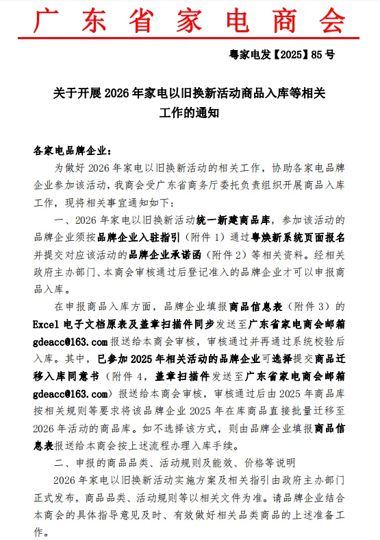
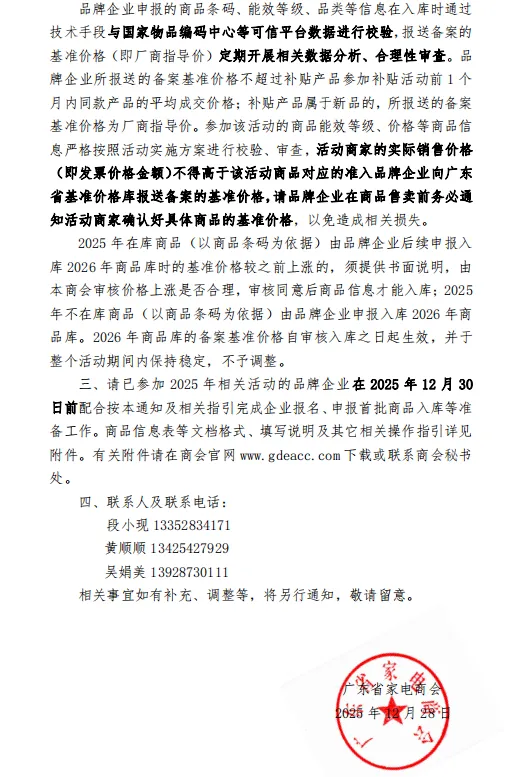

# 关于开展 2026 年家电以旧换新活动商品入库等相关工作的通知

> 来源: 广东惠州
> 原文链接: https://mp.weixin.qq.com/s/wzikaCRJI4PVotaYrK-Pmw
> 截止时间: 未知
> 抓取时间: 2026/1/5 11:30:29

各家电品牌企业:

      为做好2026年家电以旧换新活动的相关工作，协助各家电品牌企业参加该活动，我商会受广东省商务厅委托负责组织开展商品入库工作，现将相关事宜通知如下。请各企业严格对照本通知要求，落实申报材料准备、商品信息填报等工作，确保申报流程合规、信息真实准确。如有疑问可及时与商会对接，共同保障活动有序开展。

      联系人及联系电话：

      段小现13352834171

      黄顺顺13425427929

      吴娟美13928730111 

